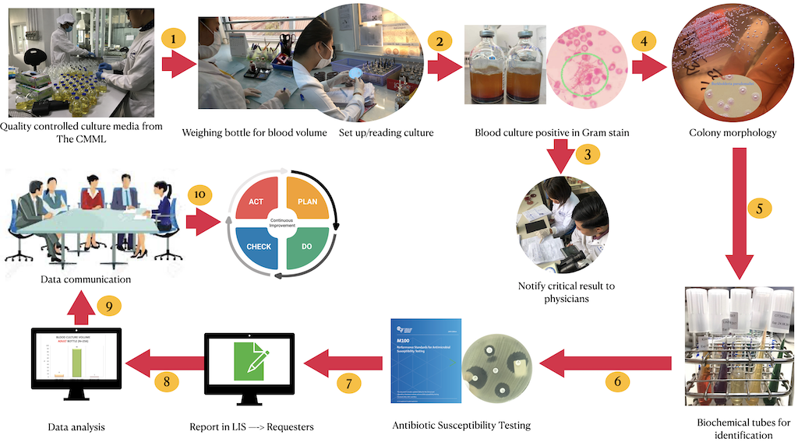
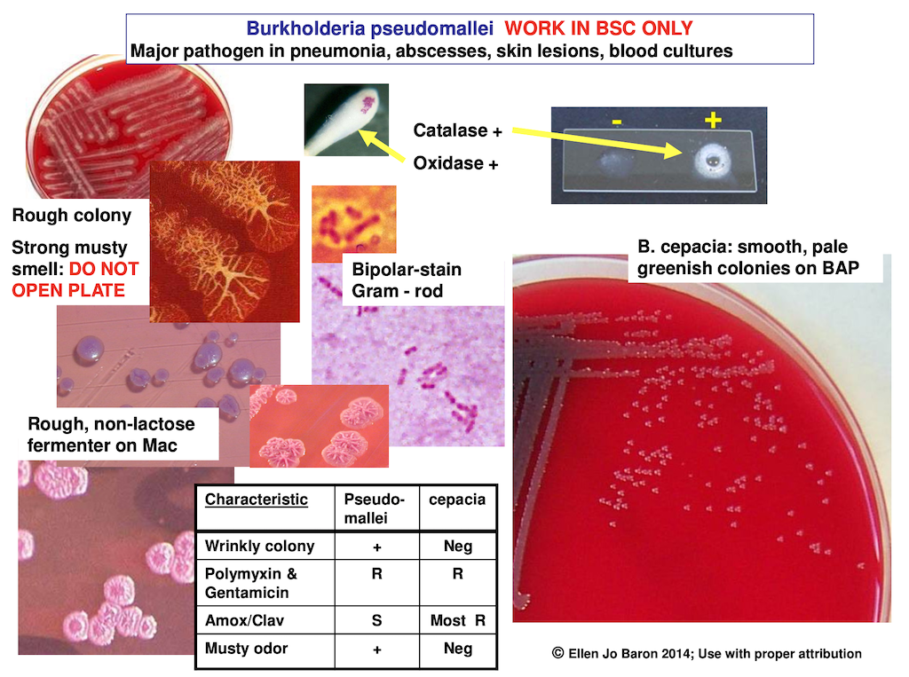
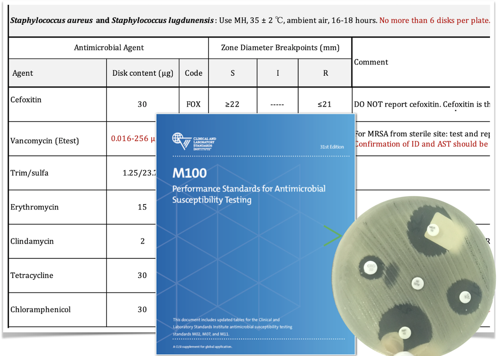
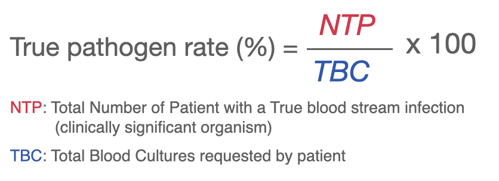
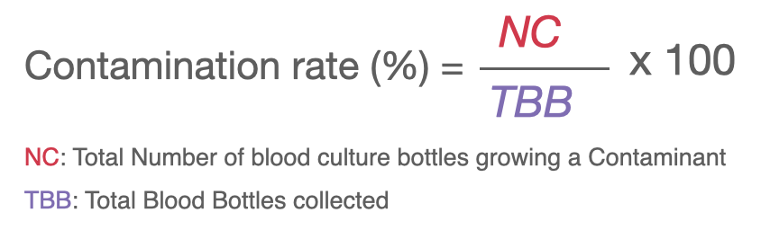

<!-- Version 3 update on 9/03/22 -->

```{r setup, include=FALSE}
knitr::opts_chunk$set(echo = F,
                      message = F,
                      warning = F, 
                      tidy = T,
                      comment = F,
                      fig.align = 'center',
                      results = 'asis',
                      collapse = T)
```

```{css}
.table-hover > tbody > tr:hover { 
  background-color: #f4f442;
}

h1.title {
  font-weight: bold;
  text-align: center;
}
h2:hover, h3:hover {
    font-size: 30px;
    font-size-adjust: 20px;
    font-style: italic;
    font-weight: bold;
    color: red;
    transition: all 100ms;
}

.tocify {
  border-color: red;
  border-radius: 8px;
}

.figure:hover{
  box-shadow: 0 0 4px 2px rgba(0, 140, 186, 0.5);
}

#cont_rat, #true_path {
  text-align: center;
}
.end_report {
  text-align: right;
}

.style {
color: red;
font-weight: bold;
}

```

## 1. Introduction {.tabset}

### Context

Siem Reap, Takeo, Battambang and Kampong Cham clinical microbiology laboratories based at Provincial Referral Hospitals (250-300 beds), receive technical and supply support such as long term mentoring, culture media and diagnostic reagents from the Diagnostic Microbiology Development Program ([DMDP](http://dmdp.org)).

Culture media including blood culture bottles, agar plates and biochemical tubed media are produced centrally at the Central Media Making Laboratory (CMML) at the University of Health Sciences, Phnom Penh. CMML, ISO 9001:2015 certified, performs media quality control before distribution to the clinical laboratories.

### Laboratory procedures

#### a. Specimen processing

Clinical laboratories use a manual blood culture system. Blood culture bottles are registered and staff measure blood culture volume by weighing the bottles. Air venting needles are inserted before incubation for 7 days. After overnight incubation at 35^o^C, laboratory staff inspect bottles daily for signs of organism growth such as turbidity, bubbles or hemolysis. Staff perform blind sub culture and Gram stain at 24h and terminal subculture (or Gram stain) at day 7. If positive, laboratory staff notify clinician immediately.

::: {#blood_process .figure}
{width="80%"}
:::

#### b. Bacterial identification

If organisms are detected, microbiologists will perform further identification by using Standard Operating Procedures and Job aids. Example, Dr. Ellen Jo Baron and DMDP flowcharts for identification of *Burkholderia pseudomallei* and Staphylococci.

::: {#bacteria_id .figure}
{width="80%"}
:::


#### c. Antibiotic Susceptibility Testing

Antibiotic Susceptibility Testing follows Clinical and Laboratory Standards Institute [(CLSI)](https://clsi.org) performance standards, M100 and M02 for disk diffusion testing. MIC using gradient diffusion (Biomerieux) is used for selected antibiotic organism combinations.

:::{#AST .figure}

{width="80%"}

:::

### Data management

Patient information and laboratory data are registered in the Cambodian laboratory information system [(CamLIS)](http://camlis.net/en/login). Every month microbiologists analyse data and communicate findings with local hospital healthcare professionals. Raw data are extracted from CamLIS as an Excel file and stored in a folder "Microbiology Report/data". Data analysis was conducted by using R Markdown with pre-writing plain texts and [R programming language](https://cran.r-project.org) version R 4.1.2. Packages tidyverse 1.3.1, AMR 1.8.0, janitor 2.1.0, readxl 1.3.1, plotly 4.10.0, kableExtra 1.3.4 and readxl 1.4.1 were used as minimum requirement. The report from R Markdown is generated in HTML format which can be opened with any web browser in electronic devices or computer. e.g Google Chrome, Safari etc.

## 2. Patient demographic

We assume a patient receives care at a hospital (inpatients and outpatients) or private clinics and has only one patient identification number. We removed duplicates to find the actual number of patient requests. Thus, we have: <span class="style"> `r dedup_by_pid %>% count() %>% mutate_if(is.numeric,format,big.mark=",")` patient(s)</span>

\newpage

### 2.1. Gender

The proportion of patients by gender

```{r gender distribution,fig.width=4, fig.height=4}
dedup_by_pid %>%
  group_by(sex) %>%
  summarise(n = n()) %>%
  ungroup %>%
  mutate(pct = round_half_up(n/sum(n)*100)) %>%
  mutate(sex = recode(sex, F = "Female", M = "Male")) %>%
  plot_ly(type = 'pie', labels = ~sex, values = ~pct,
          textinfo = 'label+percent',
          hoverinfo = 'text',
          text = ~paste(sex, pct, "%"),
          insidetextfont = list(color = 'black', size = 14),
          #hole = 0.2,
          showlegend = FALSE,
          marker = list(
            colors = c("rgb(248, 118, 109)","rgb(3, 191, 196)"),
            line = list(color = 'white', width = 4)
            )) %>%
   config(displayModeBar = F)


```

### 2.2. Age

Distribution of age group and gender. We accepted the range 0 to 110 years old. We have <span class="style">`r dedup_by_pid %>% filter(age>=0, age<=40150) %>% count() %>% mutate_if(is.numeric,format, big.mark = ",")` patient(s)</span>

```{r age distribution,fig.height=4, warning=FALSE}
p <- dedup_by_pid %>%
  select(age, sex) %>% 
  mutate(sex = recode(sex, F = "Female", M = "Male")) %>% 
  filter(age >= 0, age <= 40150) %>%   # age [0-110y]
  mutate(age = age_groups(age,c(28,365,1825,5475,9125,12775,16425,20075,
                                23725,27375))) %>%
  group_by(age, sex) %>% count() %>% 
  ggplot(aes(age, n, fill = sex, text = paste0(sex,": ", n))) +
  geom_bar(stat = "identity") + 
  geom_text(aes(label = ifelse(n < 15, "", n)),
            position = position_stack(vjust = 0.5), size = 2.5) +
  labs(x = "Age", y = "Count") +
  theme_bw() +
  theme(panel.grid.major.x = element_blank(), 
        legend.title = element_blank()) +
  scale_x_discrete(labels = c("<28d","29d-1y","1-4y","5-14y","15-24y","25-34y","35-44y","45-54y","55-64y","65-74y",">75y")) + 
  scale_y_continuous(expand = expansion(mult = c(.01, 0.10)))

ggplotly(p, tooltip = "text") %>% 
  layout(legend = list(title = list(text = ""),
                       x = 1, y = 0.5),
         font = list(color = "black")) %>% 
  config(displayModeBar = F)

rm(p)
```

\newpage

## 3. Microbiology specimen

A patient can have more than one microbiology specimen collected. We assume one specimen has one unique sample identification number. After removing duplicates, we have: <span class="style">`r dedup_by_id_stype %>% count() %>% mutate_if(is.numeric,format,big.mark=",")` sample(s)</span>. We stratify data by month and sample type

```{r specimen color}
specimen_color <- c("Blood Culture" = "#F7766D", # blood red
                     "Pus" = "#D1B087", # pus yellow-gray
                     "Urine" = "#F7A62C", 
                     "Body Fluid" = "#C3CDF6",
                     "CSF" = "#FFCCCC",
                     "Sputum" = "#B4AC54",
                     "Stool" = "#BBBBBB",
                     "Genital swab" = "#F76ACD",
                     "Throat swab" = "#BE3737",
                     "Tissue" = "#DC376F"
                               )
```

```{r microbiology sample by month, fig.height=8}
# fig.height=8
# sample by month from site
sample_by_month <- dedup_by_id_stype %>% 
  select(collection_date_in_month, sample) %>% 
  group_by(collection_date_in_month) %>% 
  count(sample) %>% 
  mutate(m = ifelse(n > mean(n), mean(n)*0.6, mean(n)*0.3))

# plot bar chart
p <- sample_by_month %>% 
  ggplot(aes(reorder(sample, n), n, fill = sample)) + 
  geom_bar(stat = "identity", aes(text = paste0(sample, ":", n))) +
  geom_text(aes(label = n, y = n + m), size = 2.5) +
  labs(x = "", y = "") +
  coord_flip() + 
  facet_wrap(~ collection_date_in_month) +
  theme_bw() +
  theme(legend.position = "none",
        axis.text = element_text(color = "black"),
        axis.title = element_text(size = 10),
        panel.grid.major = element_blank()) +
  scale_y_continuous(expand = expansion(mult = c(.01, .10))) +
  scale_fill_manual(values = specimen_color)

 ggplotly(p, tooltip = "text") %>%  
   config(displayModeBar = F,
         locale = "km") 
  
rm(p,sample_by_month)
```

For further insight, we stratified by sample sources

```{r ward count and specimen color}
ward <- data %>% distinct(sample_source) %>% count()
ward_count <- case_when(ward <= 7 ~  10,
                        ward <= 12 ~ 12,
                        ward <= 17 ~ 14, 
                        TRUE ~ 20
                        )
rm(ward)
```

```{r spe by ward, fig.width=8, fig.height= ward_count}

p <- dedup_by_id_stype %>% 
  select(sample, sample_source) %>% 
  group_by(sample, sample_source) %>% 
  summarise(n = n()) %>%  
  group_by(sample_source) %>% 
  mutate(total = sum(n),
        m = case_when(n >= 400 ~ n * 0.1,
                      n >= 200 ~ n * 0.2,
                      n >= 100 ~ n * 0.3,
                      n >= 50 ~ n * 0.4,
                      n >= 25 ~ n * 0.7,
                      n >= 10 ~ n *1.1,
                      TRUE ~ n * 3)
         ) %>%
  ggplot(aes(reorder(sample, n), n, fill = sample)) + 
  geom_bar(stat = "identity", aes(text = paste0(sample,": ",n))) + 
  geom_text(aes(label = n, y = n + m), size = 2.4) +
  coord_flip() +
  facet_wrap(~ reorder(paste0(sample_source,"\n(Total = ", total,")"), -total), ncol = 3) +
  labs(x = "", y = "Count") +
  scale_y_continuous(expand = expansion(mult = c(.01, .10))) +
  theme_bw() +
   theme(legend.position = "none",
        axis.text = element_text(color = "black"),
        axis.title = element_text(color = "black"),
        panel.grid.major = element_blank(),
        strip.background = element_rect(fill = "#D0D0E4"),
        strip.text.x = element_text(size = 10,
                                    margin = margin(0.29,0,0.29,0, "cm")
                                    )) + 
  scale_fill_manual(values = specimen_color)


ggplotly(p, tooltip = "text") %>%
  layout(margin = list(t = 55)) %>% 
  config(displayModeBar = F)


```

Specimen rejection

```{r cal specimen rejection}

no_sample <- "(\u179c\u17b7\u1797\u17b6\u1782|\u179f\u17c6\u178e\u17b6\u1780)?.*(\u1796\u17bb\u17c6\u1798\u17b6\u1793|\u1782\u17d2\u1798\u17b6\u1793|\u1798\u17b7\u1793\u1798\u17b6\u1793)(?!(\u17a2\u178f\u17d2\u178f|\u1796.*\u1798\u17b6\u1793)).*(\u179c\u17b7\u1797\u17b6\u1782|\u179f\u17c6\u178e\u17b6\u1780)?"

no_label <- "(\u179c\u17b7\u1797\u17b6\u1782|\u179f\u17c6\u178e\u17b6\u1780)?.*(\u1796\u17bb\u17c6\u1798\u17b6\u1793|\u1782\u17d2\u1798\u17b6\u1793|\u1798\u17b7\u1793\u1798\u17b6\u1793)(?=(\u17a2\u178f\u17d2\u178f|\u1796.*\u1798\u17b6\u1793)).*(\u179c\u17b7\u1797\u17b6\u1782|\u179f\u17c6\u178e\u17b6\u1780)?"


spe <- dedup_by_id_stype %>% 
  group_by(sample) %>% summarise(m = n())


reject_com <- reject_spe %>% # change word to no sample or no label
  mutate_at(vars(comment, reject_comment),
            ~ str_replace_all(., pattern = "\u200B", "")) %>%
  mutate_at(vars(comment, reject_comment),
            ~ ifelse(str_detect(., no_sample) == TRUE,
                     "no sample", .)) %>%
  mutate_at(vars(comment, reject_comment),
            ~ ifelse(str_detect(., no_label) == TRUE,
                     "no label", .)) %>% 
  mutate_at(vars(comment, reject_comment), 
            ~ ifelse(str_detect(., "(?i)no specimen")==TRUE,
                     "no sample", .))

reject_com <- reject_com %>% 
  mutate(reject = str_extract(str_to_lower(comment), ">.*10.*epi.*lpf|no sample|no label"),
        reject_comment = str_replace(reject_comment, "Sugg.*$","")
        ) %>% 
  mutate(reject = coalesce(reject, reject_comment),
         reject = str_to_sentence(reject),
         reject = str_replace(reject, "lpf", "LPF")) %>% 
  filter(!is.na(reject)) %>% 
  mutate(sample = ifelse(reject == "> 10 epithelial cell/LPF", "Sputum", sample)) %>%
  group_by(sample, reject) %>% count()
  

```

```{r specimen rejection, results='asis'}

if (nrow(reject_com) > 0) {
total_spe <- reject_com %>% 
left_join(., spe) %>% 
  group_by(sample, m) %>% 
  summarise(n1 = sum(n)) %>%
  mutate(total = n1 + m) %>% 
  select(sample, total) 

left_join(reject_com, total_spe) %>% 
  select(Specimen = sample, `Total specimen` = total, `Total reject` = n, Reasons = reject) %>% 
  
  kable(align = c("l", 'c', 'c','l'), escape = F) %>% 
  kable_styling(fixed_thead = T, bootstrap_options = c("condensed","striped", "hover","responsive", "bordered")) %>%
  kableExtra::collapse_rows(1:2, valign = "middle") %>% 
  row_spec(0,background = "#FFFF1E")
}
rm(spe, reject_com, total_spe)
```

## 4. Cerebrospinal fluid (CSF) pathogens isolated

```{r positive csf}
csf <- data %>% 
  filter(sample == "CSF", !is.na(results), results != "No growth") %>% 
  summarise(n = n())
```

There were <span class="style">`r csf` CSF</span> positive.

```{r CSF}
if (csf > 0) {
csf <- data %>% 
  select(sample, results, age) %>% 
  filter(sample == "CSF", !is.na(results), results != "No growth") %>% 
  mutate(desc = case_when(age < 5110 ~ "Pediatric (<14 years old)",
                          TRUE ~ "Adult (>=14 years old)")) %>% 
  group_by(results, desc) %>% 
  summarise(n = n(), .groups = "drop") 

p <- csf %>%   
  ggplot(aes(reorder(results, n), n, fill = results)) + 
  geom_bar(stat = "identity", width = 0.5, aes(text = paste0(results,": ",n))) + 
  facet_wrap(~desc) +
  geom_text(aes(label = n, y = n + (mean(n)*0.1)), size = 3, hjust = -0.2) +
  coord_flip() +
  labs(x = "", y = "Cases") +
  theme_bw() +
  theme(axis.text.y = element_text(face = "italic", color = "black"),
        legend.position = "none", 
        panel.grid = element_blank(),
        axis.ticks.y.right = element_blank()) +
  scale_y_continuous(expand = expansion(mult = c(.01,.10)))

p$data$results <- paste0("<i>", p$data$results, "</i>")
ggplotly(p, tooltip = "text") %>% 
  config(displayModeBar = F)

      }
```

## 5. Blood culture

Blood culture is defined as a critical specimen. Data from blood culture can be used for quality improvement and developing guidelines, surveillance of emerging pathogens and antibiotic resistance. Only the first of each pathogen for each patient in the period of 30 days was counted. Patient identification, collection date and organism name are used to find the first isolate.

### 5.1. Blood culture request by patient and true pathogen rate

Patient identification and blood samples were filtered to define the number of patient requests by month. We have <span class= "style">`r data %>% filter(sample=="Blood Culture") %>% distinct(patient_id, keep.all=T) %>% summarise (n=n()) %>% mutate_if(is.numeric, format, big.mark=",")` patient(s)</span> blood culture requests. Calculate true pathogen rate:

:::{#true_path .figure}

{width="50%"}

:::

The true pathogen rate expected range is 6% to 12%.

```{r request and true pathgens rate}
 # finding blood culture number each month
 bc <- data %>%
  filter(sample == "Blood Culture") %>% 
  distinct(patient_id, .keep_all = T) %>% 
  group_by(collection_date_in_month) %>%
  summarise(blood_culture_count = n(),.groups = "drop") 

bc_org <- bc_first_isolate %>% 
  group_by(collection_date_in_month) %>%
  summarise(pathogen_count = n(),.groups = "drop")

#  merge specimen and true pathogen by month together
merge_bc_org <- full_join(bc, bc_org) %>% 
   mutate_all(~replace(., is.na(.), 0)) %>% 
  mutate(pathogen_rate = round_half_up(pathogen_count/blood_culture_count*100))

merge_bc_org %>% 
  ggplot() +
  geom_bar(aes(collection_date_in_month, blood_culture_count, 
               fill = collection_date_in_month),
               stat = "identity", width = 0.2) +
  geom_hline(yintercept = 120,linetype = "dashed") +
  geom_hline(yintercept = 60,linetype = "dashed") +
  geom_label(aes(collection_date_in_month,blood_culture_count, 
                 label = blood_culture_count), size = 3) +
  geom_line(aes(collection_date_in_month, pathogen_rate*10, group = 1),
            color = "red") +
  geom_label(aes(collection_date_in_month, pathogen_rate*10,
                 label = pathogen_rate),fill = "#FFFF00",size = 3) +
  scale_y_continuous(expand = expansion(mult = c(.01,.10)),
                     sec.axis = sec_axis(~./10, name = "True pathogen rate",
                                  labels = function(x) paste0(x, " %"))) +
  labs(x = "Month", y = "Blood culture request by patient") +
  theme_bw() + 
  theme(legend.position = "non", 
        axis.title = element_text(size = 10),
        axis.title.y.right = element_text(angle = 90))
 
rm(bc,bc_org,merge_bc_org)
```

### 5.2. Bloodstream pathogens isolated

```{r pathogen}
blood_path <- bc_first_isolate %>%
  mutate(desc = case_when(age < 5110 ~ "Pediatric (<14 years old)",
                              TRUE ~ "Adult (>=14 years old)"),
         results = recode(results,"Streptococcus, beta-haemolytic (not Group A, not Group B)" = "Beta-streptococcus not A, not B")) %>% 
  group_by(results, desc) %>% 
  mutate(n = n()) %>% 
  group_by(results) %>% 
  mutate(m = n()) %>%
  distinct(results, desc, n, m) 


```


```{r Bloodstream pathogens isolated, fig.height = ifelse(nrow(blood_path)>10, 7, 3)}

p <- blood_path %>%
  ggplot(aes(reorder(results, m), n, fill = results)) +
  geom_bar(stat = "identity", aes(text = paste0(results,": ", n))) + 
  facet_wrap(~ desc) +
  geom_text(aes(label = n, y = n + (mean(n)*0.50)), size = 3) +
  labs(x = "",y = "Cases") +
  coord_flip() +
  theme_bw() +
  theme(axis.text.y = element_text(face = "italic", color = "black"),
        legend.position = "none", 
        panel.grid = element_blank(),
        #axis.text = element_blank(),
        strip.background = element_rect(fill = "#CCE8EA"),
        axis.ticks.y.right = element_blank()) +
  scale_y_continuous(expand = expansion(mult = c(.01, .10)))

p$data$results <- paste0("<i>", p$data$results, "</i>")
ggplotly(p, tooltip = "text") %>% 
  config(displayModeBar = F)

rm(blood_path, p)
```

```{r true pathogens by month}
da <- cbind(month, results = rep("Escherichia coli", 12), n = rep(0))

df <- bc_first_isolate %>% 
  select(collection_date_in_month,results) %>% 
  group_by(collection_date_in_month,results) %>% 
  summarise(n = n(),.groups = "drop")

full_join(df, da, by = c("collection_date_in_month", "results", "n")) %>% 
  group_by(collection_date_in_month,results) %>% 
  summarise(n = sum(n),.groups = "keep") %>% 
  filter(collection_date_in_month %in% last_month$collection_date_in_month) %>%
  pivot_wider(names_from = collection_date_in_month,values_from = n) %>% 
  mutate_all(~replace(., is.na(.), 0)) %>% 
  mutate(Total = rowSums(across(where(is.numeric)))) %>% 
  arrange(-Total) %>%
  rename("Pathogen" = results) %>% 
  kable(align = c("l", 'c', 'c','c','c','c','c','c','c','c','c','c')) %>% 
  kable_styling(fixed_thead = T, bootstrap_options = c("condensed","striped", "hover","responsive")) %>%
  row_spec(0,background = "#FFFF1E") %>% 
  column_spec(1,italic = T)

rm(da,df)
```

\newpage

### 5.3. Blood culture bottle collected and contamination rate

Blood culture contamination can lead to inappropriate treatment of patients, over use of resources and a workload burden. Microbiologists are obliged to monitor and report contamination rate regularly to specimen collectors. We defined contaminant as *Coagulase negative Staphylococci*, *Corynebacterium sp.*, *Streptococcus viridans, alpha-hem.*, *Micrococcus sp.*.

:::{#cont_rat .figure}

{width="50%"}

:::

The expected contamination rate is \< 3%.

```{r contamination rate}
# finding number of bottle in each month. Deduplicate by laboratory identification
bottle_by_month_data <- data %>% 
  filter(sample == "Blood Culture") %>% 
  select(lab_id,sample,age,volume1,volume2,collection_date_in_month) %>% 
  distinct(lab_id,.keep_all = T) %>% 
  pivot_longer(c("volume1","volume2"), names_to = "volume", values_drop_na = T) %>%
  group_by(collection_date_in_month) %>%
  summarise(bottle_by_month_data = n(),.groups = "drop") 

# finding contamination organism by month and identify them as first 
cont_org <- bc_cont_deduplicate %>% 
  group_by(collection_date_in_month) %>%
  summarise(cont_org = n(),.groups = "drop") 

# Merging data of blood culture bottle and contamination organism 
merge_bottle_org <- full_join(bottle_by_month_data, cont_org, 
                              by = "collection_date_in_month") %>% 
                  mutate_all(~replace(., is.na(.), 0)) %>% 
                  mutate(cont_rate = round_half_up(cont_org/bottle_by_month_data*100))

# plotting data in bar chart
merge_bottle_org %>% 
  ggplot() +
  geom_bar(aes(collection_date_in_month, bottle_by_month_data, 
               fill = collection_date_in_month), stat = "identity", width = 0.2) +
  geom_hline(yintercept = 60, linetype = "dashed",color = "red") +
  geom_label(aes(collection_date_in_month,bottle_by_month_data, label = bottle_by_month_data), size = 3) +
  geom_line(aes(collection_date_in_month, cont_rate*20, group = 1), color = "red") +
  #geom_point(aes(collection_date_in_month, cont_rate*20), color = "black") +
  geom_label(aes(collection_date_in_month, cont_rate*20,label = cont_rate),fill = "#FFFF00",size = 3) +
  scale_y_continuous(expand = expansion(mult = c(.01,.10)),
                     sec.axis = sec_axis(~./20, name = "Contamination rate",
                                         labels = function(x) paste0(x, ... = "%"))) +
  labs(x = "Month", y = "Blood culture bottles") +
  theme_bw() +
  theme(legend.position = "non", axis.title = element_text(size = 10),
        axis.title.y.right = element_text(angle = 90))
 
rm(bottle_by_month_data, merge_bottle_org)

```

NB: To count total number of blood culture bottle collected, we use the blood culture volume field. If blood culture volume is not recorded in CamLIS, the total number of blood culture collected will be lower and the contamination rate will be higher then the real situation.

```{r contamination organism by month}

da <- cbind(month,results = rep(c("Bacillus","Coagulase Negative Staphylococcus","Corynebacterium","Streptococcus viridans, alpha-hem.","Micrococcus"),12),n = rep(0,12))             

df <- bc_cont_deduplicate %>%
  select(collection_date_in_month,results) %>% 
  group_by(collection_date_in_month,results) %>%
  summarise(n = n(),.groups = "keep")
  
  full_join(df, da, by = c("collection_date_in_month", "results", "n")) %>% group_by(collection_date_in_month,results) %>% 
  summarise(n = sum(n), .groups = "drop") %>%
  filter(collection_date_in_month %in% last_month$collection_date_in_month) %>% 
  pivot_wider(names_from = collection_date_in_month,values_from = n) %>%
  #mutate_all( ~replace(., is.na(.), 0)) %>%
  adorn_totals("col") %>% # add column total at the end
  #mutate(Total=rowSums(across(where(is.numeric)))) %>% 
  arrange(-Total) %>%
  rename("Organism" = results) %>% 
  kable(align = c("l", 'c', 'c','c','c','c','c','c','c','c','c','c')) %>% 
  kable_styling(fixed_thead = T, bootstrap_options = c("condensed","striped", "hover","responsive")) %>% 
  row_spec(0,background = "#E5C4FF") %>% 
  column_spec(1,italic = T)
  
  rm(da,df)
```

### 5.4. Blood culture true pathogen rate and contamination rate by sample sources

```{r true pathogens and contatamination}
# finding patient request by wards
request <- data %>% 
  filter(sample == "Blood Culture") %>%
  distinct(patient_id, sample_source, .keep_all = T) %>% 
  group_by(sample_source) %>% 
  summarise("Patient request" = n())

org <- bc_first_isolate %>% 
  group_by(sample_source) %>% 
  summarise("True pathogen" = n())

# merge patient request and true pathogens by wards
r_org <- merge(request,org,all = T) %>% 
  as.data.frame() %>% 
  mutate_all(~replace(., is.na(.), 0)) %>% 
  mutate("True pathogen" = paste0(`True pathogen`," (",round_half_up(`True pathogen`/`Patient request`*100)," %)"))

# finding number of bottle by wards
bottle <- data %>% 
  filter(sample == "Blood Culture") %>% 
  distinct(lab_id,.keep_all = T) %>% 
  pivot_longer(c("volume1","volume2"),names_to = "volume",values_drop_na = T) %>%
  group_by(sample_source) %>% 
  summarise("Number of bottle" = n())

# finding contamination organism by wards
cont <- bc_cont_deduplicate %>% 
  group_by(sample_source) %>%
  summarise(Contamination = n())

# merge number of bottle and contamination 
bottle_cont <- merge(bottle,cont,all = T) %>% 
  mutate_all( ~replace(., is.na(.), 0)) %>% 
  mutate("Contamination" = paste0(Contamination," (", round_half_up(Contamination/`Number of bottle`*100,0)," %)"))


# merge patient request, true pathogen, number of bottle and contamination by wards
merge(r_org,bottle_cont,all = T) %>% 
  rename(`Sample Source` = sample_source, `True pathogens (%)` = `True pathogen`, `Contamination (%)` = Contamination) %>%
  arrange(-`Patient request`) %>%

  kable(align = c('l','c','c','c','c')) %>% 
  kable_styling(fixed_thead = T, bootstrap_options = c("condensed", "striped", "hover","responsive")) %>% 
  row_spec(0, background = "#9DC055") %>% 
  add_footnote(label = "* Specimen from private clinc/laboratory", notation = "non") 

# remove variables
rm(bottle_cont,cont,bottle,r_org,org,request, cont_org)

```

### 5.5. Blood culture volume

Blood culture volume is vital to detect organism growth. For adult patients, two bottles are collected from two different venipunctures with the target of 8-12ml of blood and pediatric patients, one bottle collected with the target of 1-6ml of blood. One patient may grow two organisms and is represented by two rows in the CamLIS database. One sample has only one unique laboratory identification number. Therefore, we removed blood culture volume duplicates by sample laboratory identification number.

```{r b_volume}
# create a column to save if blood culture volume is correct, low or high
b_volume <- data %>%
  select(age, volume1, volume2, sample, lab_id, collection_date_in_month, results) %>% 
  filter(sample == "Blood Culture") %>% 
  distinct(lab_id,.keep_all = T) %>% 
  mutate_at(vars(starts_with("volume")), as.numeric) %>% 
  pivot_longer(c("volume1","volume2"), names_to = "bottle") %>% 
  mutate(vs = case_when(age<365 & value <0.5   ~  "Too low",  # Pediatric
                        age<365 & value <=6    ~  "Correct",
                        age<365 & value >6     ~  "Too high",
                        age<5110 & value <2    ~  "Too low",
                        age<5110 & value <=6   ~  "Correct",
                        age<5110 & value >6    ~  "Too high",
                        age>=5110 & value < 8  ~  "Too low",     #Adult
                        age>=5110 & value <=12 ~  "Correct",
                        age>=5110 & value >12  ~  "Too high",
                        is.na(value)         ~  "no volume"
  ))

```

<!-- Adult blood culture volume -->

#### 5.5.1. Adult

```{r adult blood volume}
# Adult blood culture blood volume
ad_volume <- b_volume %>% 
  filter(age >= 5110, vs != "no volume") %>%
  group_by(collection_date_in_month) %>% 
  mutate(bottle = n()) %>%
  group_by(collection_date_in_month,bottle,vs) %>% 
  summarise(n = n(), pect = n/bottle, .groups = "keep") %>% 
  distinct(collection_date_in_month,.keep_all = T) %>% 
  mutate(vs = case_when(vs=="Too low"  ~ "Too low (<8ml)",
                        vs=="Correct"  ~ "Correct (8-12ml)",
                        vs=="Too high" ~ "Too high (>12ml)"))

# calculate total number of bottle
t_bottle <- ad_volume %>% 
  as.data.frame() %>% 
  distinct(collection_date_in_month,.keep_all = T) %>% 
  summarise(t_bottle = sum(bottle),.groups = 'drop')

# plot data
ad_volume %>% 
  ggplot(aes(collection_date_in_month, pect, 
             fill = factor(vs,levels = c("Too low (<8ml)",
             "Correct (8-12ml)","Too high (>12ml)")))) +
  geom_bar(position = position_dodge2(preserve = "single", width = 1), 
           stat = "identity") +
  geom_hline(yintercept = 0.8, linetype = "dashed") +
  geom_text(aes(label = round_half_up(pect*100)), position = position_dodge2(preserve = "single", width = 1),vjust = -0.2, size = 3) +
  theme_bw() +
  theme(legend.title = element_blank(),
        plot.title = element_text(hjust = 0.5, face = "bold"),
        axis.text = element_text(color = "black")) +
  scale_fill_manual(values = c("Too low (<8ml)"   = "#FBB917", # yellow
                               "Correct (8-12ml)" = "#41A317", # green
                               "Too high (>12ml)" = "#F75D59")) + # red 
  scale_y_continuous(expand = expansion(mult = c(.01,.10)),
                     labels = scales::percent, limits = c(0,1)) +
  labs(x = "Month",y = "Percentage (%)", 
       title = paste0("Adult (age>=14 years) blood culture volume \n (Total=  ",format(t_bottle, big.mark = ",")," bottles)"))

rm(t_bottle,ad_volume)

```

<!-- Adult only one bottle -->

```{r adult patient collects one blood culture bottle}
# adult patient request
adult_request <- data %>%
  filter(sample == "Blood Culture", age >= 5110) %>% 
  distinct(patient_id, .keep_all = T) %>% # deduplicate by Pid
  group_by(collection_date_in_month) %>%
  summarise(ad_request = n())

# Adult solidary bottle
solitary_bottle <- data %>%
  filter(sample == "Blood Culture", age >= 5110, !is.na(volume1)) %>% 
  distinct(lab_id, .keep_all = T) %>% 
  filter(is.na(volume2)) %>% 
  group_by(collection_date_in_month) %>% 
  summarise(solitary_bottle = n())

# join data frame
ad_sol <- left_join(adult_request, solitary_bottle, by = "collection_date_in_month") %>%
  mutate_all(~replace(.,is.na(.),0))
  #mutate(across(where(anyNA), ~ replace_na(., 0))) 

ad_sol %>% 
ggplot() +
  geom_bar(aes(collection_date_in_month, ad_request, fill = collection_date_in_month), show.legend = F, stat = "identity", width = 0.2) +
  geom_label(aes(collection_date_in_month, ad_request, label = ad_request), size = 3) +
  geom_line(aes(collection_date_in_month, solitary_bottle*2, group = 1), size = 1, color = "red") +
  geom_label(aes(collection_date_in_month, solitary_bottle*2, label = solitary_bottle),fill = "#FFFF00", size = 3) +
  scale_y_continuous(expand = expansion(mult = c(.01,.10)),
                     sec.axis = sec_axis(~.*2, name = "Solitary bottle")) +
  labs(x = "Month",
       y = "Adult patient",
       title = "Adult patient with solitary blood culture bottle") +
  theme_bw() +
  theme(plot.title = element_text(hjust = 0.5, face = "bold"),
        axis.text = element_text(color = "black"),
        axis.title.y.right = element_text(angle = 90))

rm(adult_request,solitary_bottle, ad_sol)
```

#### 5.5.2. Pediatric

<!-- Pediatric blood volume -->

```{r pediatric blood volume}

# Pediatric blood culture blood volume
p_volume <- b_volume %>% 
  filter(age < 5110, vs != "no volume") %>%
  group_by(collection_date_in_month) %>% 
  mutate(bottle = n()) %>%
  group_by(collection_date_in_month,bottle,vs) %>% 
  summarise(n = n(),pect = n/bottle, .groups = "keep") %>% 
  distinct(collection_date_in_month,.keep_all = T) %>% 
  mutate(vs = case_when(vs=="Too low" ~ "Too low (<1ml)",
                        vs=="Correct" ~ "Correct (1-6ml)",
                        vs=="Too high" ~ "Too high (>6ml)"))

# calculate total number of bottle
t_bottle <- p_volume %>% 
  as.data.frame() %>% 
  distinct(collection_date_in_month,.keep_all = T) %>% 
  summarise(t_bottle = sum(bottle))

# plot data
p_volume %>% 
  ggplot(aes(collection_date_in_month,pect,
             fill = factor(vs,levels = c("Too low (<1ml)","Correct (1-6ml)","Too high (>6ml)")))) +
  geom_bar(position = position_dodge2(preserve = "single",width = 1), stat = "identity") +
  geom_hline(yintercept = 0.8,linetype = "dashed") +
  geom_text(aes(label = round_half_up(pect*100)), 
            position = position_dodge2(preserve = "single",width = 1),vjust = -0.2,size = 3) +
  theme_bw() +
  theme(legend.title = element_blank(),
        plot.title = element_text(hjust = 0.5, face = "bold"),
        axis.text = element_text(color = "black")) +
  scale_fill_manual(values = c("Too low (<1ml)" = "#FBB917",
                               "Correct (1-6ml)" = "#41A317",
                               "Too high (>6ml)" = "#F75D59")) +
  scale_y_continuous(expand = expansion(mult = c(.01,.10)),
                     labels = scales::percent,limits = c(0,1)) +
  labs(x = "Month",y = "Percentage (%)", 
       title = paste0("Pediatric (age<14 years) blood culture volume \n (Total= ",format(t_bottle,big.mark = ",")," bottles)"))

rm(t_bottle,p_volume)
```

#### 5.5.3. Adult and Pediatric

```{r checking missing blood culture volume}
# create a blank data
blank <- cbind(month, 'Bottle A' = rep(0, 12), 'Bottle B' = rep(0, 12), Total = rep(0,12))

  bottle <- b_volume %>% 
    select(-vs) %>% 
    pivot_wider(names_from = "bottle",values_from = "value") %>% 
    group_by(collection_date_in_month) %>% 
    select(collection_date_in_month,age,results,volume1,volume2)
  
  bottle_A <- bottle %>% 
    filter(!is.na(results),is.na(volume1)) %>% 
    summarise('Bottle A' = n()) 
  
  bottle_B <- bottle %>% 
    filter(!is.na(results), is.na(volume1), is.na(volume2),age >= 5110) %>%
    summarise('Bottle B' = n()) 
  
  
 missing_bv <- full_join(bottle_A, bottle_B, 
                         by = "collection_date_in_month") %>% 
    list(., blank) %>% 
   reduce(full_join, by = "collection_date_in_month") %>%
   mutate_if(is.numeric, ~replace(., is.na(.), 0)) %>% 
   #mutate_all( ~replace(., is.na(.), 0)) %>% 
   mutate('Bottle A' = `Bottle A.x` + `Bottle A.y`,
          'Bottle B' = `Bottle B.x` + `Bottle B.y`,
          Total = `Bottle A` + `Bottle B`) %>% 
   select(collection_date_in_month, 'Bottle A', 'Bottle B', Total) %>% 
   filter(collection_date_in_month %in% last_month$collection_date_in_month) %>%
   arrange(collection_date_in_month)
 

 miss_bv <- missing_bv %>% select(Total) %>% sum()
 
```

<!-- There were [`r miss_bv` bottle(s)]{style="color:red;font-weight:bold;"} with empty blood culture volume field in CamLIS. This table is used to monitor number of blood culture collected per patient and impact of missing blood culture volume data. -->

<!-- Missing blood culture volume -->

```{r  missing blood culture volume, results='asis'}
if (miss_bv > 0) {
  cat(paste0("[",miss_bv," bottles]{style='color:red;font-weight:bold;'}"," empty blood culture volume in CamLIS and it is impacted on the calculation of contamination rate <br><br>")) 
 
  missing_bv %>% 
    rename(Month = collection_date_in_month) %>% 
    arrange(Month) %>% 
    mutate_if(is.numeric, ~replace(., is.na(.), 0)) %>% 
    #mutate_all(~replace(., is.na(.), 0)) %>% 
    kable(align = c("l", 'c', 'c','c'),) %>% 
    kable_styling(bootstrap_options = c("condensed","bordered","striped", "hover","responsive")) %>%
    add_header_above(c("Missing blood culture volume" = 4),bold = T,background = "#FFF8D8") %>%
    row_spec(0,background = "#FFE4C4")
}else{cat("Well done. All bottles are weighted and recorded volume in CamLIS")}

rm(bottle,bottle_A,bottle_B,missing_bv,miss_bv,b_volume, blank)
```

\newpage

### 5.6. Blood culture day of positivity

Microbiology laboratories always report the day of blood culture positivity in the patient report comment. We present the common pathogens isolated.

```{r checking_day_growth, results='asis'}

record <- comment %>% filter(is.na(day_growth)) %>% count()

if (record > 0) {
cat(paste("[", record,"patient]{style='color:red;font-weight:bold;'}","had no record of the day of positivity, therefore, it was excluded in the analysis."))
  
}else{cat("Well done. All blood culture positive days were recorded in CamLIS")}

rm(record)

```

<!-- [`r comment %>% filter(is.na(day_growth)) %>% count()` patient(s)]{style="color:red;font-weight:bold;"} had no record of the day of positivity, therefore, it was excluded in the analysis. -->

```{r day of positive, fig.width= 8}
organism <- c("Escherichia coli", "Klebsiella pneumoniae", "Acinetobacter","Burkholderia pseudomallei", "Pseudomonas aeruginosa", "Non-fermenting gram negative rods", "Staphylococcus aureus", "Coagulase Negative Staphylococcus", "Cryptococcus")

day_growth <- comment %>% 
  filter(results %in% organism, !is.na(day_growth)) %>% 
  group_by(results, day_growth) %>% 
  count(day_growth)


p <- day_growth %>% 
  ggplot(aes(day_growth, n)) + 
  geom_bar(stat = "identity", width = 0.7, aes(fill = results, text = paste0(results, ": ", n," case(s)", "\nGrowth on day: ", day_growth))) +
  geom_text(aes(label = n, y = n + (mean(n)*0.15)), size = 2.7) +
  facet_wrap(~ results) +
  labs(y = "Cases", x = "Day") +
  scale_y_continuous(expand = expansion(mult = c(.01, .10)), 
                     labels = scales::label_number(accuracy = 1)) +
  theme_bw() +
  theme(legend.position = "none",
        axis.text = element_text(color = "black"),
        strip.background = element_rect(fill = "#D5DBDB"),
        strip.text = element_text(size = 9))

p$data$results <- factor(paste0("<i>", p$data$results, "</i>"), 
                        levels = c("<i>Escherichia coli</i>", 
                                   "<i>Klebsiella pneumoniae</i>",
                                   "<i>Acinetobacter</i>", 
                                   "<i>Burkholderia pseudomallei</i>",
                                   "<i>Pseudomonas aeruginosa</i>",
                                   "<i>Non-fermenting gram negative rods</i>",
                                   "<i>Staphylococcus aureus</i>",
                                   "<i>Coagulase Negative Staphylococcus</i>",
                                   "<i>Cryptococcus</i>"))


ggplotly(p, tooltip = "text") %>%
  config(displayModeBar = F)

```

\newpage

### 5.7. Blood culture TurnAround Time

TurnAround Time (TAT) is the expectation time that laboratory report result back to collectors. According to Excel extracted from CamLIS, we can report positive blood culture TAT from specimen collection to Notify Gram stain.

```{r TAT, results='asis'}

record <-  TAT %>% filter(is.na(primary_report)) %>% count()

if (record > 0) {
cat(paste("[", record,"records]{style='color:red;font-weight:bold;'}","missed document date or time and excluded in the analysis."))
}else{cat("Well done. Date and Time notifiable are recorded")}
rm(record)
```

```{r blood TAT}
# data

TAT <- TAT %>% 
  filter(!is.na(primary_report))

record <- TAT %>% 
  select(primary_report) %>% count()

TAT <- TAT %>% 
  select(collection_date, primary_report, patient_id) %>% 
  mutate(tat_h = round_half_up(as.numeric(difftime(primary_report, collection_date, units = "hours"))))

TAT %>% 
  plot_ly() %>% 
  add_boxplot(y = ~tat_h, 
            boxpoints = "all",
            jitter = 0.7,
            pointpos = 0,
            name = "", 
            boxmean = TRUE,
            fillcolor = "pink",
            #line = list(color = 'blue'),
            marker = list(symbol = "dot", color = "purple"),
            hoverinfo = "y") %>% 
  layout( title = list(text = paste0("Blood Culture TurnAround Time (TAT)\n","(Total=",record,")"), 
                       x = 0.5,
                       font = list(color = "black")),
          yaxis = list(title = "Hour", range = list(0, 250)),
          xaxis = list(title = "Collection-Notify Gram stain")
          ) %>% 
  config(displayModeBar = F)
```

```{r checking tat_h}
if (min(TAT$tat_h) <= 0) {
  cat("Below are incorrect record(s):")
  TAT %>% 
    filter(tat_h <= 0) %>% 
    arrange(tat_h) %>% 
    kable(align = c("l", 'l', 'l', 'r')) %>%
    kable_styling(fixed_thead = T, bootstrap_options = c("striped", "hover","responsive"))
}

```


### 5.8. Blood culture critical result reporting

Positive blood cultures are life threatening for patients and require immediate reporting.\
We analysed data and found [`r critical_result$p`%]{style="color:blue; font-size:16px; font-weight:bold; background-color: #FFEB14"} of `r critical_result$total` critical results were recorded in CamLIS as reported.

## 6. Notifiable and other important pathogens list

**Pathogens per patient from all specimen types**

```{r notifiable pathogens,results='asis'}
# Create a list of organism in notifiable
org_notifiable <- c("Burkholderia pseudomallei",
            "Salmonella Typhi", 
            "Salmonella Paratyphi A",
            "Streptococcus suis",
            "Vibrio cholerae",
            "Bacillus anthracis",
            "Yersinia pestis",
            "Francisella tularensis",
            "Corynebacterium diphtheriae",
            "Neisseria gonorrhoeae",
            "Neisseria meningitidis",
            "Listeria monocytogenes")

month_data <- data %>% # move to general in fuction?
  distinct(collection_date_in_month) %>% 
  pivot_wider(names_from = collection_date_in_month, 
              values_from = collection_date_in_month)

org <- data %>% # from data set select only notifiable organism
  select(patient_id,results, collection_date_in_month) %>% 
  filter(results %in% org_notifiable | str_detect(results, "(?i).*salmonella.*")) %>%
  arrange(collection_date_in_month) %>% 
  distinct(patient_id, .keep_all = T) %>% 
  group_by(results, collection_date_in_month) %>% 
  mutate(n = sum(n())) %>% 
  select(-patient_id) %>% 
  distinct(.keep_all = T) %>%
  pivot_wider(names_from = collection_date_in_month,values_from = n) 
  
org <- org %>% # adding month with empty data
  add_column(!!!month_data[setdiff(names(month_data), names(org))]) %>% 
  #mutate_if(is.factor, as.character) %>% 
  mutate_all(., ~str_replace(., pattern = "Jan|Feb|Mar|Apr|May|Jun|Jul|Aug|Sep|Oct|Nov|Dec", '0')) %>% 
  select(results, order(factor(names(.), levels = month.abb)))

list(org, data.frame(results = org_notifiable)) %>% 
  reduce(full_join, by = "results") %>% 
  mutate_all( ~replace(., is.na(.), 0)) %>% 
  mutate_if(is.character, as.numeric) %>% 
  mutate(Total = rowSums(across(where(is.numeric)))) %>% 
  arrange(-Total) %>%
  rename("Pathogen" = results) %>% 
  kable(align = c("l", 'c', 'c','c','c','c','c','c','c','c','c','c')) %>% 
  kable_styling(fixed_thead = T, bootstrap_options = c("striped", "hover","responsive")) %>% 
  row_spec(0,background = "#FFEB14") %>% 
  column_spec(1,italic = T) %>% 
  add_footnote(c("NB: Salmonella were confirmed by Salmonella O Polyvalent Antisera serology"), notation = "non") 
 
rm(org_notifiable, org)
```

**Screening for multi-drug resistant organisms isolated from all specimen types**\
- Cefoxitin resistance for methicillin-resistant staphylococcus aureus (MRSA)\
- Vancomycin for vancomycin intermediate staphylococcus aureus (VISA) or vancomycin resistance staphylococcus aureus (VRSA)\
- Ceftriaxone and/or ceftazidime non susceptible for Extended Spectrum Beta-lactamase (ESBL) *Escherichia coli* and *Klebsiella pneumoniae*. A small number of isolates will be missed using this criteria.\
- Imipenem and/or meropenem non susceptible for Carbapenem-resistant (CRE) *Escherichia coli* and *Klebsiella pneumoniae*

```{r MDR}
mdr <- data %>% # filter and deduplicate by pateint ID
  arrange(collection_date) %>% 
  distinct(patient_id, .keep_all = T) %>%
  filter(results %in% c("Staphylococcus aureus", "Escherichia coli", "Klebsiella pneumoniae")) 

MRSA <- mdr %>% # filter S.aurues and resistance to Cloxacillin
  filter(CLO == "R", results == "Staphylococcus aureus") %>% 
  mutate(MDR = as.character(recode(CLO, "R" = "MRSA"))) %>% 
  select(results, MDR, collection_date_in_month) %>% 
  group_by(results, MDR, collection_date_in_month) %>% count() 

VRSA <- mdr %>% # filter S.aurues and resistance to VA
  filter(VAN %in% c("R","I"), results == "Staphylococcus aureus") %>% 
  mutate(MDR = as.character(recode(VAN, "R" = "VRSA", "I" = "VRSA"))) %>% 
  select(results, MDR, collection_date_in_month) %>% 
  group_by(results, MDR, collection_date_in_month) %>% count() 

ESBL <- mdr %>% # filter E.coli and K.pneumoniae and Cetri and Cefta
  filter(results %in% c("Escherichia coli", "Klebsiella pneumoniae")) %>%
  drop_na(CRO, CAZ) %>% 
  select(results, CRO, CAZ, collection_date_in_month) %>% 
  mutate(CRO = case_when(CRO == "R" ~ 1, 
                         CRO == "I" ~ 1, 
                         CRO == "S" ~ 0),
         CAZ = case_when(CAZ == "R" ~ 1, 
                         CAZ == "I" ~ 1, 
                         CAZ == "S" ~ 0), 
         MDR = CRO + CAZ,
         MDR =  case_when(MDR >= 1 ~ "ESBL")) %>% 
  filter(!is.na(MDR)) %>% 
  select(results, MDR, collection_date_in_month) %>% 
  group_by(results, MDR, collection_date_in_month) %>%
  count() 

CRE <- mdr %>% # filter E.coli and K.pneumoniae and Imipenem and Meropenem
  filter(results %in% c("Escherichia coli", "Klebsiella pneumoniae")) %>%
  drop_na(IPM, MEM) %>% 
  select(results, IPM, MEM, collection_date_in_month) %>% 
  mutate(IPM = case_when(IPM == "R" ~ 1, 
                         IPM == "I" ~ 1, 
                         IPM == "S" ~ 0),
         MEM = case_when(MEM == "R" ~ 1, 
                         MEM == "I" ~ 1, 
                         MEM == "S" ~ 0), 
         MDR = IPM + MEM,
         MDR =  case_when(MDR >= 1 ~ "CRE")) %>% 
  filter(!is.na(MDR)) %>% 
  select(results, MDR, collection_date_in_month) %>% 
  group_by(results, MDR, collection_date_in_month) %>%
  count() 

rbind(ESBL, CRE, MRSA, VRSA) %>% 
  pivot_wider(names_from = "collection_date_in_month",values_from = "n") %>% 
  add_column(!!!month_data[setdiff(names(month_data), names(.))]) %>% 
  #mutate_if(is.factor, as.character) %>% 
  mutate_all(., ~ str_replace(., pattern = "Jan|Feb|Mar|Apr|May|Jun|Jul|Aug|Sep|Oct|Nov|Dec", '0')) %>% 
  select(results, MDR, order(factor(names(.), levels = month.abb))) %>% 
  mutate_all( ~replace(., is.na(.), 0)) %>% 
  mutate_if(is.character, as.numeric) %>% 
  mutate(Total = rowSums(across(where(is.numeric)))) %>% 
  arrange(-Total) %>%
  rename("Organism" = results,
         "Mechanisms" = MDR) %>% 
  kable(align = c("l", 'c', 'c','c','c','c','c','c','c','c','c','c','c','c','c')) %>% 
  kable_styling(fixed_thead = T, bootstrap_options = c("condensed","striped", "hover","responsive")) %>% 
  row_spec(0, background = "#C3FDB8") %>% 
  column_spec(1,italic = T)
  
rm(mdr, MRSA, ESBL, CRE, VRSA)
```

**Tracking [blood culture]{style="color:red"} isolates by month for possible Healthcare Associated Infection (HAI)**. We filtered blood culture collection date after 48 hours of admission with common bacteria associated with HAI.

```{r checking_HAI, comment="#", results='asis'}

record <-  HAI %>% filter(is.na(HAI)) %>% count()

if (record > 0) {
cat(paste("[", record,"records]{style='color:red;font-weight:bold;'}"," excluded due to no admission or collection date."))
  
}
rm(record)
```

```{r HAI}
org <- HAI %>% 
  filter(HAI > 48, !is.na(HAI)) %>% 
  group_by(results, collection_date_in_month) %>% 
  mutate(n = sum(n())) %>% 
  select(-patient_id:-admission_date, -HAI) %>% 
  distinct(.keep_all = T) %>%
  pivot_wider(names_from = collection_date_in_month, values_from = n) 

org <- org %>% # adding month with empty data
  add_column(!!!month_data[setdiff(names(month_data), names(org))]) %>% 
  mutate_if(is.factor, as.character) %>% 
  mutate_all(., ~ str_replace(., pattern = "Jan|Feb|Mar|Apr|May|Jun|Jul|Aug|Sep|Oct|Nov|Dec", '0')) %>%
  select(results, order(factor(names(.), levels = month.abb)))

list(org, data.frame(results = org_in_hos)) %>% 
  reduce(full_join, by = "results") %>% 
  mutate_all(~replace(., is.na(.), 0)) %>% 
  mutate_if(is.character, as.numeric) %>% 
  mutate(Total = rowSums(across(where(is.numeric)))) %>% 
  arrange(-Total) %>%
  rename("Organism" = results) %>% 
  kable(align = c("l", 'c', 'c','c','c','c','c','c','c','c','c','c','c','c')) %>% 
  kable_styling(fixed_thead = T, bootstrap_options = c("condensed","striped", "hover","responsive")) %>% 
  row_spec(0, background = "#FFEB14") %>% 
  column_spec(1,italic = T)

rm(org_in_hos, org, month_data, HAI)

```

\newpage

## 7. *Burkholderia pseudomallei (Bps)*

```{r check presenting of organsims}

# adding month, sample and n value to data frame to fill the gape of month without data
blank_data <- cbind(month, sample = rep("", 12), n = rep(0, 12))

# Bps isolate number
bps <- data %>% 
  select(results) %>% 
  filter(results == "Burkholderia pseudomallei") %>%
  summarise(n = n())

# Salmonella isolate number
sal <- data %>% 
    select(sample,results) %>% 
    filter(str_detect(results, "(?i).*salmonella.*")) %>% 
    summarise(n = n())

# Staphylococcus aureus isolate number and blood culture
sau <- bc_first_isolate %>% 
    select(results) %>% 
    filter(results == "Staphylococcus aureus") %>% 
    summarise(n = n())

# Escherichia coli isolate number
eco <- bc_first_isolate %>% 
    select(results) %>%  
    filter(results == "Escherichia coli") %>% 
    summarise(n = n())

# Klebsiella pneumoniae isolate number
kpn <- bc_first_isolate %>% 
    select(results) %>%  
    filter(results == "Klebsiella pneumoniae") %>% 
    summarise(n = n())

# Pseudomonas aeruginosa isolate number
pse <- bc_first_isolate %>% 
    select(results) %>% 
    filter(results == "Pseudomonas aeruginosa") %>% 
    summarise(n = n())

# Acinetobacter isolate number
ac <- bc_first_isolate %>% 
    select(results) %>% 
    filter(results == "Acinetobacter") %>% 
    summarise(n = n())

rm(month)
```

There were [`r bps` *Burkholderia pseudomallei*]{style="color:red;font-weight:bold;"} reported.

```{r Burkholderia pseudomallei}
if (bps > 0) {

d <- data %>% 
  filter(results == "Burkholderia pseudomallei") %>%
  group_by(collection_date_in_month, sample) %>% 
  summarise(n = n(),.groups = "keep") 

da <- rbind(blank_data, d) %>% 
   mutate(collection_date_in_month = factor(collection_date_in_month,
                                            levels = month.abb)) %>% 
  group_by(collection_date_in_month,sample) %>%
  summarise(n = sum(n),.groups = "keep") %>%  
  filter(collection_date_in_month %in% last_month$collection_date_in_month,
         sample != "") %>% 
  group_by(collection_date_in_month) %>% 
  mutate(total = sum(n))

 p <- da %>%
  rename(month = collection_date_in_month) %>% 
  ggplot() +
  geom_bar(aes(month,n, fill = sample, 
               text = paste0(sample,": ", n)),
               stat = "identity", width = 0.5) +
   geom_text(aes(month, total + ifelse(total < 10, 0.7, 1), label = paste0("Total: ", total)), size = 3,
                stat = "identity") +
  theme_bw() +
  labs(x = "Month", y = "Bps cases") +
  scale_fill_manual(values = specimen_color) +
  scale_y_continuous(expand = expansion(mult = c(.01,.10)), 
                     labels = scales::number_format(accuracy = 1))
 
ggplotly(p, tooltip = "text" ) %>% 
  layout(legend = list(title = list(text = ""),
                               x = 1, y = 0.5   
                                  )) %>% 
  config(displayModeBar = F)


}
```

<!-- Monitor AST pattern of Bps -->

```{r bps AMR, results='asis'}
if (bps > 0) {
data %>% 
  filter(results %in% "Burkholderia pseudomallei") %>% 
  select(results, AMC,CAZ,MEM,TMP,GEN) %>%
  mutate(mo = as.mo(results, info = F)) %>% 
  bug_drug_combinations() %>%
  rename(Organism = mo, Antibiotic = ab, Total = total) %>% 
  mutate(Antibiotic = ab_name(Antibiotic)) %>% 
  select(Antibiotic,S,I,R,Total) %>% 
  kable(align = c("l", 'c', 'c','c','c'), table.attr = "style='width:70%;'") %>% 
  kable_styling(bootstrap_options = c("condensed","striped", "hover","responsive"), position = "left") %>% 
  add_header_above(c("Antibiotic Susceptibility Patterns" = 5), bold = T,background = "#FFA500") %>% 
  footnote("S: susceptible, I: intermediate, R: resistant", general_title = "") %>% 
  row_spec(0, background =  "#FFE4E1") %>% 
  column_spec(2:5, width = "5em") %>% 
  column_spec(2,color = "#6698FF",bold = T) %>%
  column_spec(4,color = "#F88017",bold = T)
}
```

\newpage

## 8. Salmonella

There were [`r sal` *Salmonella species*]{style="color:red;font-weight:bold;"} reported.

```{r Salmonella}
if (sal > 0) {
d <- data %>% 
  filter(str_detect(results, "(?i).*salmonella.*")) %>% 
  group_by(collection_date_in_month, sample) %>% 
  summarise(n = n(),.groups = "keep")

da <- rbind(blank_data, d) %>% 
   mutate(collection_date_in_month = factor(collection_date_in_month,
                                            levels = month.abb)) %>% 
  group_by(collection_date_in_month,sample) %>%
  summarise(n = sum(n),.groups = "keep") %>%  
  filter(collection_date_in_month %in% last_month$collection_date_in_month,
         sample != "")

p <- da %>%
  rename(month = collection_date_in_month) %>% 
  ggplot() +
  geom_bar(aes(month,n, fill = sample, 
               text = paste0(sample,": ", n)),
           stat = "identity",width = 0.5) +
  theme_bw() +
  labs(x = "Month", y = "Salmonella cases") +
  #scale_y_continuous(limits = c(0,max(da$total))) +
  scale_fill_manual(values = specimen_color) +
  scale_y_continuous(limits = c(0, 3))

ggplotly(p, tooltip = "text" ) %>% 
  layout(legend = list(title = list(text = ""),
                               x = 1, y = 0.5   
                                  )) %>% 
  config(displayModeBar = F)

}

```

## 9. Cumulative Antibiotic Susceptibility Testing (cAST)

We filter [blood culture]{style="color:red"} by first pathogen isolated in an period of 30 days and apply all EUCAST expert rules for Intrinsic Resistance and Unusual Phenotypes (AMR v3.3, 2021) before analyzing antibiotic susceptibility patterns. We produced cAST for pathogens included in the [GLASS](https://www.who.int/initiatives/glass) priority pathogen list.

### 9.1. *Staphylococcus aureus*

There were <span class = "style">`r sau` *Staphylococcus aureus* </span> reported.

```{r S.aureus cAST}
if (sau > 0) {
bc_first_isolate %>% 
  filter(mo %in% c("B_STPHY_AURS")) %>%
  select(mo,CLO,CZO,ERY,CLI,TCY,CHL,TMP,VAN) %>%
  bug_drug_combinations() %>% 
  rename(Organism = mo, Antibiotic = ab, Total = total) %>% 
  mutate(Antibiotic = ab_name(Antibiotic)) %>% 
  select(Antibiotic,S,I,R,Total) %>% 
  filter(Total > 0) %>% 
  kable(align = c("l",'c', 'c','c','c'), table.attr = "style='width:70%;'") %>% 
  kable_styling(fixed_thead = T, bootstrap_options = c("condensed","striped", "hover","responsive")) %>% 
  footnote("  S: susceptible, I: intermediate, R: resistant
           Cloxacillin resistance: MRSA", general_title = "") %>% 
  row_spec(0,background = "#FFA500") %>% ##FFE4E1 good color pink
  column_spec(2:5, width = "5em") %>% 
  column_spec(2, color = "#6698FF",bold = T) %>%
  column_spec(4,color = "#F88017",bold = T)
}
#rm(sau)
```

### 9.2. *Escherichia coli*

There were [`r eco` *Escherichia coli*]{style="color:red;font-weight:bold;"} reported.

```{r E.coli cAST}
if (eco > 0) {
bc_first_isolate %>% 
  filter(mo %in% c("B_ESCHR_COLI")) %>%
  select(mo,AMP,AMC,CRO,CAZ,MEM,IPM,GEN,AMK,CIP,TMP,CHL) %>% 
  bug_drug_combinations() %>%
  rename(Organism = mo,Antibiotic = ab, Total = total) %>%
  mutate(Antibiotic = ab_name(Antibiotic)) %>%
  select(Antibiotic,S,I,R,Total) %>% 
  kable(align = c("l",'c', 'c','c','c'), table.attr = "style='width:70%;'") %>% 
  kable_styling(fixed_thead = T, bootstrap_options = c("condensed","striped", "hover","responsive")) %>% 
  footnote("  S: susceptible, I: intermediate, R: resistant", general_title = "") %>% 
  row_spec(0,background = "#FFA500") %>% 
  column_spec(2:5, width = "5em") %>% 
  column_spec(2,color = "#6698FF",bold = T) %>%
  column_spec(4,color = "#F88017",bold = T)
}
rm(eco)
```

### 9.3. *Klebsiella pneumoniae*

There were [`r kpn` *Klebsiella pneumoniae*]{style="color:red;font-weight:bold;"} reported.

```{r K.pneumoniae cAST}
if (kpn > 0) {
bc_first_isolate %>% 
  filter(mo %in% c("B_KLBSL_PNMN")) %>%
  select(mo,AMP,AMC,CRO,CAZ,MEM,IPM,GEN,AMK,CIP,TMP,CHL) %>% 
  bug_drug_combinations() %>%
  rename(Organism = mo,Antibiotic = ab, Total = total) %>% 
  mutate(Antibiotic = ab_name(Antibiotic)) %>%
  select(Antibiotic,S,I,R,Total) %>% 
  kable(align = c("l",'c', 'c','c','c'), table.attr = "style='width:70%;'") %>% 
  kable_styling(fixed_thead = T, bootstrap_options = c("condensed","striped", "hover","responsive")) %>% 
  #add_header_above(c("Klebsiella pneumoniae"=5),bold = T,italic = T,background ="#FFA500") %>% 
  footnote("  S: susceptible, I: intermediate, R: resistant", general_title = "") %>% 
  row_spec(0,background = "#FFA500") %>% 
  column_spec(2:5, width = "5em") %>% 
  column_spec(2,color = "#6698FF",bold = T) %>%
  column_spec(4,color = "#F88017",bold = T)
}
rm(kpn)
```

### 9.4. *Pseudomonas aeruginosa*

There were [`r pse` *Pseudomonas aeruginosa*]{style="color:red;font-weight:bold;"} reported.

```{r P.aeruginosa cAST}
if (pse > 0) {
bc_first_isolate %>% 
  filter(mo %in% c("B_PSDMN_AERG")) %>%
  select(mo,CIP,CAZ,MEM,GEN,AMK) %>% 
  bug_drug_combinations() %>%
  rename(Organism = mo,Antibiotic = ab, Total = total) %>% 
  mutate(Antibiotic = ab_name(Antibiotic)) %>%
  select(Antibiotic,S,I,R,Total) %>% 
  kable(align = c("l",'c', 'c','c','c'), table.attr = "style='width:70%;'") %>% 
  kable_styling(fixed_thead = T, bootstrap_options = c("condensed","striped", "hover","responsive")) %>% 
  #add_header_above(c("Pseudomonas aeruginosa"=5),bold = T,italic = T,background ="#FFA500") %>% 
  footnote("  S: susceptible, I: intermediate, R: resistant", general_title = "") %>% 
  row_spec(0,background = "#FFA500") %>% 
  column_spec(2:5, width = "5em") %>% 
  column_spec(2,color = "#6698FF",bold = T) %>%
  column_spec(4,color = "#F88017",bold = T)
}
rm(pse)
```

### 9.5. *Acinetobacter*

There were [`r ac` *Acinetobacter*]{style="color:red;font-weight:bold;"} reported.

```{r Acinetobacter cAST}
if (ac > 0) {
bc_first_isolate %>% 
  filter(mo %in% c("B_ACNTB")) %>%
  select(mo,CIP,CAZ,MEM,GEN,AMK,TMP) %>%
  bug_drug_combinations() %>%
  rename(Organism = mo,Antibiotic = ab, Total = total) %>% 
  mutate(Antibiotic = ab_name(Antibiotic)) %>%
  select(Antibiotic,S,I,R,Total) %>% 
  kable(align = c("l",'c', 'c','c','c'), table.attr = "style='width:70%;'") %>% 
  kable_styling(fixed_thead = T, bootstrap_options = c("condensed","striped", "hover","responsive")) %>% 
  #add_header_above(c("Acinetobacter"=5),bold = T,italic = T,background ="#FFA500") %>% 
  footnote("  S: susceptible, I: intermediate, R: resistant", general_title = "") %>% 
  row_spec(0,background = "#FFA500") %>% 
  column_spec(2:5, width = "5em") %>% 
  column_spec(2,color = "#6698FF",bold = T) %>%
  column_spec(4,color = "#F88017",bold = T)
}
rm(ac)
```

## 10. Acknowledgement

We gratefully acknowledge support from `r dic$hospital_name`, Bureau of Medical Laboratory Services (BMLS), Ministry of Health Cambodia, Laboratory Strengthening Partners, the Defense Threat Reduction Agency (DTRA) and the Diagnostic Microbiology Development Program [(DMDP)](http://dmdp.org).

------------------------------------------------------------------------


<p class="end_report"> Reported by <br> 
`r dic$report_by` <br><br><br>
`r format(Sys.Date(),"%d-%b-%Y")`</p>


```{r clear objects}
rm(list = ls())
```
